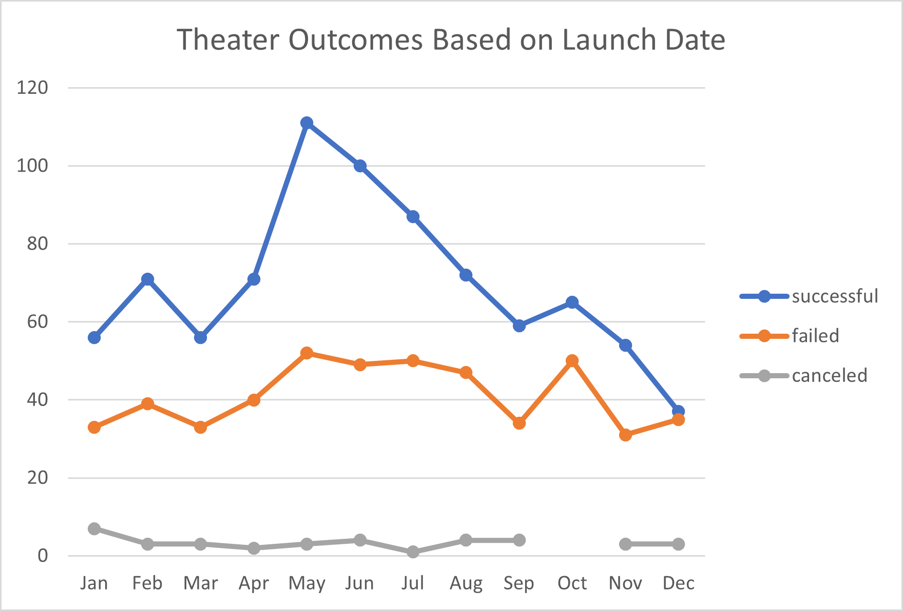
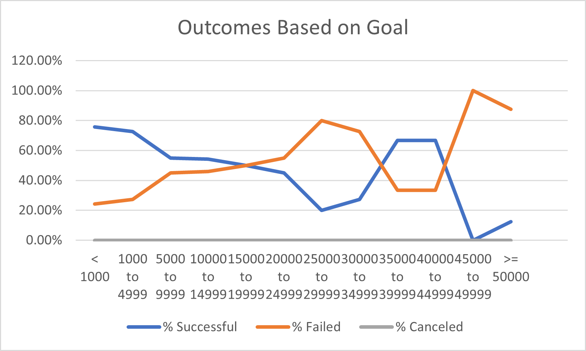

# Kickstarting with Excel

## Overview of Project
### Purpose
The purpose of this analysis was to find an optimal launch date and fundraising goal to launch a project with a higher chance of being fully funded. The analysis was done on a large data set of Kickstarter campaigns.

## Analysis and Challenges

### Analysis of Outcomes Based on Launch Date
We were interested in learning if the time of year that the kickstarter campaign for the play _Fever_ is launched was important in its chance of success. So in order to explore this, we looked at data for all other campaigns categorized as "theater" in the dataset. We were interested in the time of year (month) that the campaign was launched, and whether or not the campaign reached its fundraising goal (successful/failed/canceled). An Excel PivotTable was made with each row labeled with a month of the year, and the number of successful, failed, and canceled projects that were launched in that month are in each column respectively. This was accomplished by placing a count of outcomes in the 'values' section of the PivotTable fields. From the table a line grpah was created with the months of the year on the x axis and number of projects on the y axis. There is a line for successful, failed, and canceled projects.
### Line Chart for Outcomes vs Launch Date

### Analysis of Outcomes Based on Goals
It was also of interest to see how campaign outcomes might vary based on the fundraising goals that the theater projects have. In order to accomplish this, we created bins to sort kickstarters for plays based on goal amounts of increments of $5000 to $50,000. We used Excel's "COUNTIFS()" function to get the number of successful, failed, and canceled projects for each fundraising goal range, and then calculated a percent successful and failed based on the total number of projects in each goal range. It was a challenge when sorting for goals within the function, to not leave out a goal amount. for example if we were counting items with goals less than $1000, then the next line needs to include $1000 and up, and not say 'greater than 1000'. A similar mistake was made but discovered by counting the total number of projects. Additionally, typing in the different variations of the countif formula was tedious as each formula had many arguments from a different sheetand so this process was prone to typing error. Finally, a challenge was encounted with the function when using the wrong column lable name for the table created, but was efficiently fixed with a 'find and replace' tool. The following line chart shows the results from the data table:

### Line Chart for Outcomes vs Goal Amount

### Challenges and Difficulties Encountered

## Results

- What are two conclusions you can draw about the Outcomes based on Launch Date?

It can be concluded immediately after inspecting the outcomes vs launch date line chart that, in general there are more successful theater campaigns than failed campaigns year-round. However, there is an uptick in successful kickstarters from May to July, and lower rates of success from November to March. So there appears to me some sort of seasonality to kickstarter success for theater campaigns, and that launching the crowdfunding during the late spring and early summer may increase chances of success. Additionally, it can be concluded from the graph that more campaigns in general are launched in the summer months.

- What can you conclude about the Outcomes based on Goals?

It can be concluded that there is a general trend that the higher the Kickstarter goal amount for a play, the less likely it is to be successful. However, there seems to be an anomoly to this trent for kickstarter goals of $35,000 to $45,000, before dropping down to a very slim chance of success for goals beyond that. It is of interest that there is almost a 60% chance of success for plays between $5000 and $10,000.

- What are some limitations of this dataset?

Another limitation of this dataset, comes from the size of the dataset and the strain this puts on the Excel file, particularly when many filters, forumulas, and visualizations are applied. I was forced to re-make a leaner version of the excel file for performing the challenge because I was un-able to apply or un-apply filters to the file I used for the module lesson excercises without Excel crashing.

- What are some other possible tables and/or graphs that we could create?

We could add a line to the outcomes vs launch date sheet that visually shows the total projects launched for each month, to more clearly show trends between successful or unsuccessful projects, or change the values used to percentages. Additional exploration could be done on the number of backers and average amount donated per person, so that we can target how many people we need to reach based on goal amounts for similar projects, and how much on average we need to ask from people.